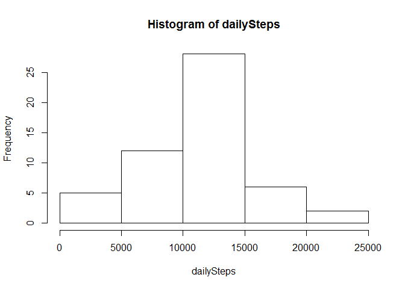
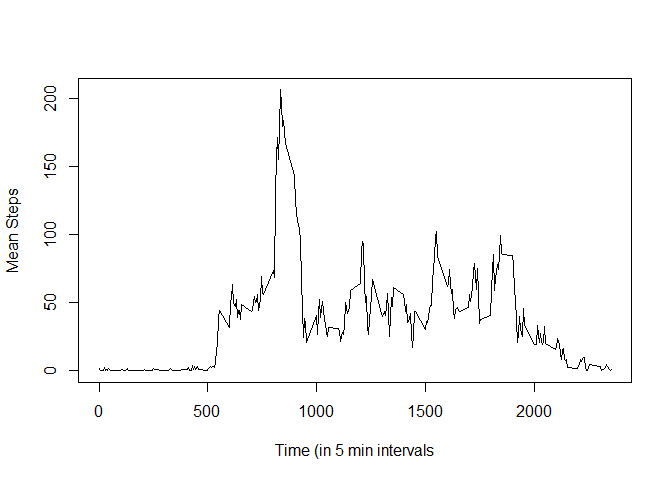
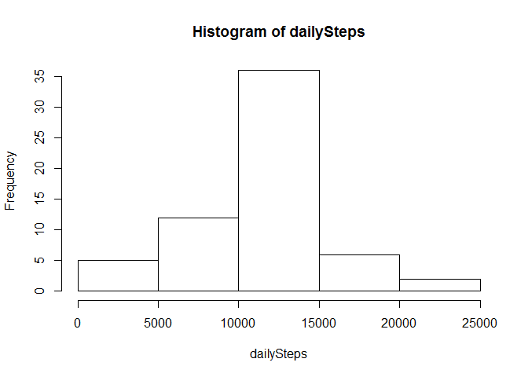
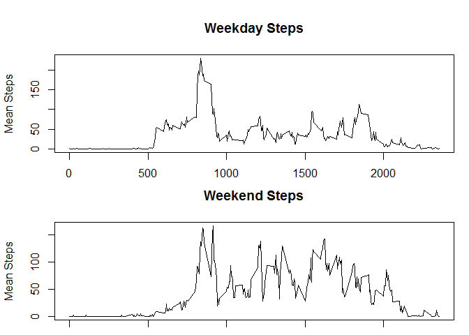

# Reproducible Research: Peer Assessment 1


## Loading and preprocessing the data


```r
x<-read.csv("activity.csv")

##remove N
x2<-as.data.frame(x[complete.cases(x),])
dates<-unique(as.Date(x2$date))
days<-split(x2,as.factor(x2$date))
```

## What is mean total number of steps taken per day?

```r
##do lapply with a function that does the some of the data frame
doSum<-function(day) {
  df<-as.data.frame(day)
  sum(df[,1])
}

dailySteps<-as.numeric(lapply(days,doSum))
dailySteps<-dailySteps[dailySteps>0]  ##ignoring days where there are no steps as first and last day is NA
hist(dailySteps)
```

<!-- -->

```r
summary(dailySteps)
```

```
##    Min. 1st Qu.  Median    Mean 3rd Qu.    Max. 
##      41    8841   10760   10770   13290   21190
```


## What is the average daily activity pattern?


```r
require(tidyr)
```

```
## Loading required package: tidyr
```

```r
x4<-spread(x2,interval,steps)

sumcol<-subset(x4, select = -date)
cmeans<-colMeans(sumcol)
ctimes<-names(x4)
ctimes<-ctimes[2:289]
plot(x=ctimes,y=cmeans,type="l",xlab = "Time (in 5 min intervals",ylab = "Mean Steps")
```

<!-- -->


## Imputing missing values
NOTE: My method for creating the missing values is taking the average for each interval using the dataset with only complete clases (x2
)  I then get a list of incomplete rows and for each empty value I replace it with the mean value for that 5 minute interval.

```r
x4<-spread(x2,interval,steps)

sumcol<-subset(x4, select = -date)
cmeans<-colMeans(sumcol)

replace<-which(is.na(x$steps))

print(length(replace))
```

```
## [1] 2304
```

```r
## for each item in x if is.na(Steps) replace with
## cmeans[row]
for(i in replace) {
    row<-i %% 288 + 1  ##each day has 288 intervals so I figure out what interval it is using the modulo of 288 +1 (since its base 1)
    rep<-as.integer(cmeans[row])
    x[i,1]<- rep
}
dates<-unique(as.Date(x$date))
days<-split(x,as.factor(x$date))
dailySteps<-as.numeric(lapply(days,doSum))
dailySteps<-dailySteps[dailySteps>0]
hist(dailySteps)
```

<!-- -->

```r
summary(dailySteps)
```

```
##    Min. 1st Qu.  Median    Mean 3rd Qu.    Max. 
##      41    9819   10640   10750   12810   21190
```


## Are there differences in activity patterns between weekdays and weekends?


```r
dows<-weekdays(as.Date(x$date))
dows[dows=="Sunday" | dows=="Saturday"]<-"Weekend"
dows[!(dows=="Weekend")]<-"Weekday"
x_wd<-cbind(x,dows)
days2<-split(x_wd,as.factor(x_wd$dows))
wdVal<-days2[[1]]
weVal<-days2[[2]]
par(mfcol=c(2,1))
par(mar=c( 1.1, 4.1, 4.1, 1.1))
wdVal2<-subset(wdVal,select = -dows)
wd2<-spread(wdVal2,interval,steps)

sumcol<-subset(wd2, select = -date)
cmeans<-colMeans(sumcol)
ctimes<-names(wd2)
ctimes<-ctimes[2:289]
plot(x=ctimes,y=cmeans,type="l",xlab = "Time (in 5 min intervals",ylab = "Mean Steps", main = "Weekday Steps")
weVal2<-subset(weVal,select = -dows)
we2<-spread(weVal2,interval,steps)

sumcol<-subset(we2, select = -date)
cmeans<-colMeans(sumcol)
ctimes<-names(we2)
ctimes<-ctimes[2:289]
plot(x=ctimes,y=cmeans,type="l",xlab = "Time (in 5 min intervals",ylab = "Mean Steps", main = "Weekend Steps")
```

<!-- -->
